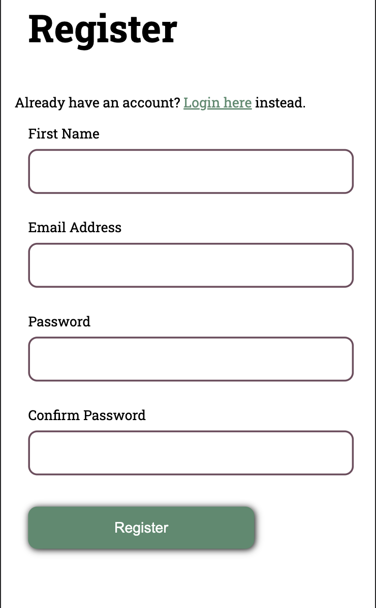
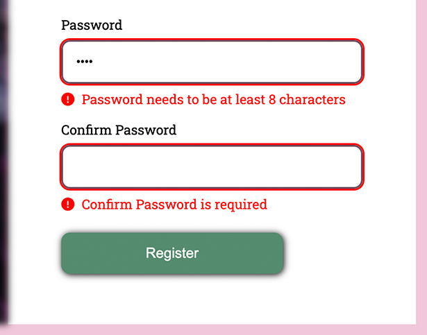
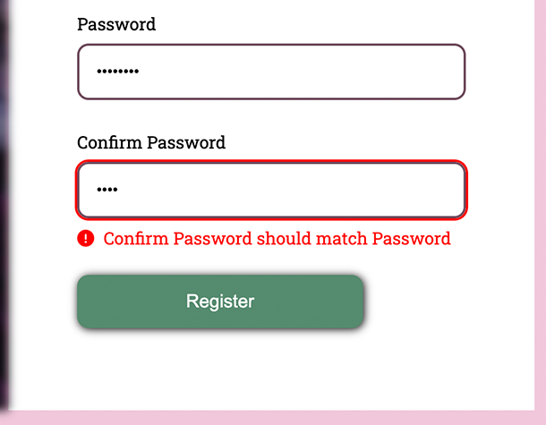

# CodeBubb Javascript Form Validation

This is a practice of Javascript form validation.

## Table of contents

- [Overview](#overview)
    - [The Goal](#the-goal)
    - [Screenshots](#screenshots)
- [My process](#my-process)
    - [Built with](#built-with)
    - [Code I'm Proud of](#code-im-proud-of)
    - [Useful resources](#useful-resources)
- [Author](#author)

## Overview

### The Goal

Users should be able to:

- Add their information to each input
- See an error message when their input does meet validation requirements
- See form validation messages if:
    - The field is left empty
    - The input does not meet preset standards
- View both mobile & desktop layouts
- See hover and focus states for all interactive elements on the page

### Screenshots







## My process

### Built with

- Semantic HTML5 markup
- CSS custom properties
- Flexbox
- Mobile-first workflow

### Code I'm Proud of

```html
  <div class="form-group">
    <label for="firstName">First Name</label>
    <input
            type="text"
            id="firstName"
            required
            minlength="2"
    >
    <div class="error-container">
      <span class="error-icon hidden">
          <i class="fa-solid fa-circle-exclamation"></i>
      </span>
      <div class="error"></div>
    </div>
  </div>
```
```css
  img {
    width: 600px;
    height: 750px;
    filter: blur(4px);
    -webkit-filter: blur(4px);
  }

  .welcome-text {
    width: 500px;
    position: absolute;
    top: 50%;
    left: 50%;
    transform: translate(-90%, -90%);
  }
```
```js
  Array.from(formElement.elements).forEach(element =>
          element.addEventListener('blur', event => {
            validateSingleFormGroup(event.target.parentElement);
          })
  );
```

### Useful resources

- [Lorem Ipsum Generator](https://loremipsum.io/generator/) - Your basic Lorem generator, nothing fancy.
- [](https://www.youtube.com/watch?v=iyngFd6f8ko&t=1253s) - The Codebubb Video - Validation
- [](https://www.youtube.com/watch?v=vrFnwDJmvBk&list=PLpc_YvcwbxaTAg0cGvqcDVmALsipqtJDY&index=17) - The Codebubb Video - Submission
- [](https://github.com/codebubb/javascript-form-validation-tutorial) - Codebubb Github

## Author

- Github - [@mariabrock](https://github.com/mariabrock)
- LinkedIn - [@mariabrock](https://www.linkedin.com/in/maria-brock/)
